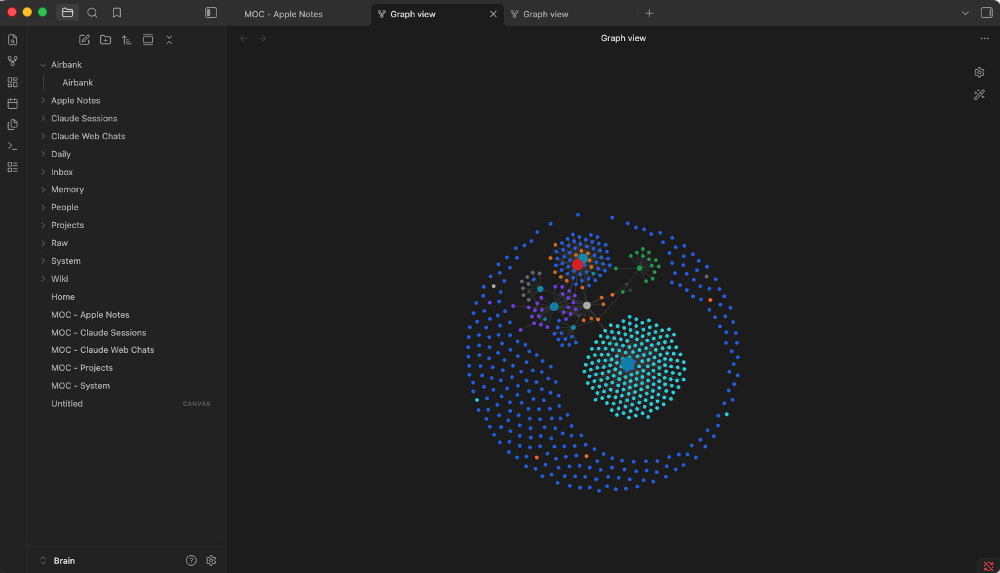
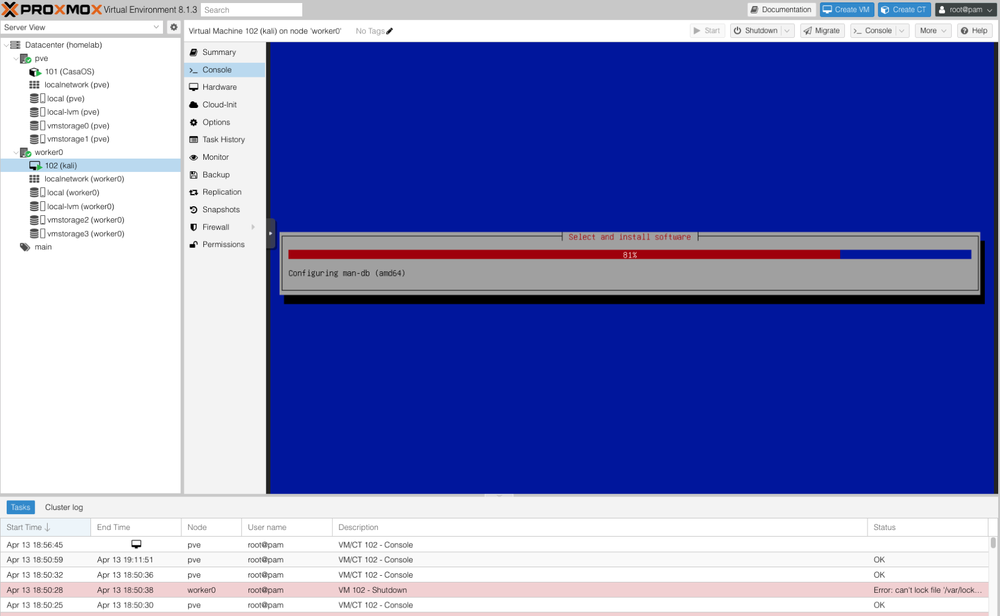
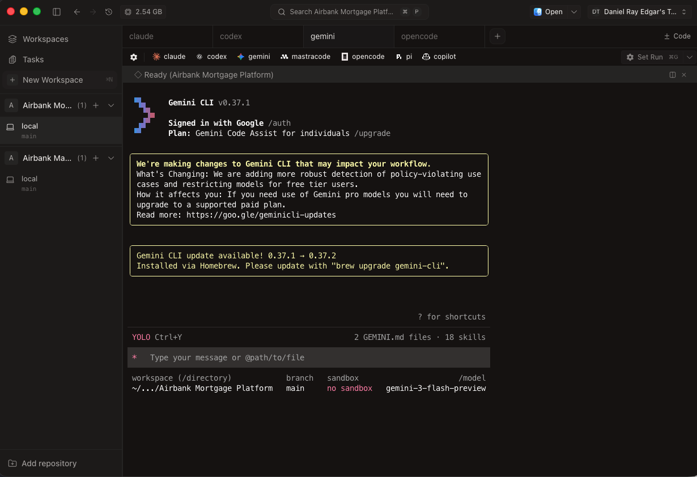

# Macintosh

Macintosh is a personal AI operating system for shipping software, compounding knowledge, and running approval-safe automation across local and homelab infrastructure.

It is the operating model behind Airbank: one coherent system spanning local development, persistent memory, private cloud execution, and controlled delivery.

## Install

```bash
curl -fsSL https://raw.githubusercontent.com/dm3n/macintosh/main/scripts/install.sh | bash
```

## What This Repository Is

This repo is the source of truth for:
- local development and agent standards
- PKB/Brain architecture and workflows
- personal cloud and homelab runtime design
- approval-gated automation model
- setup, operation, and expansion documentation

## System At A Glance

```text
Mac (Local Operator Layer)
  -> Superset terminal for coding
  -> Warp terminal for general terminal workflows
  -> Codex / Claude / Gemini / OpenCode
  -> PKB + Brain context and memory loop
  -> Tailscale secure mesh

Personal Cloud 2 (Infrastructure Layer)
  -> Proxmox cluster resource pool
  -> Kali VM (AI Repository + Cybersecurity node)
  -> Agent Hub runtime services
     -> orchestrator / approval / executor / mcp / domain agents
     -> Postgres + Redis

Control Layer
  -> Linear approval gate before external actions
```

## Visual Tour

### 1) Knowledge Layer (PKB Graph)



The Brain vault is the persistent knowledge engine that compounds across sessions, projects, and agents.

### 2) Infrastructure Layer (Proxmox + Kali Provisioning)



Proxmox hosts the personal cloud cluster where Kali and runtime services run as first-class infrastructure workloads.

### 3) Local Development Layer (Superset Coding Workspace)



Superset is the implementation-first coding surface for daily agent-driven development.

## 5-Layer Operating Model

| Layer | Function | Primary Docs |
|---|---|---|
| Build | Converts scoped work into tested, deployable output | [docs/development-workflow.md](docs/development-workflow.md), [docs/dev-environment.md](docs/dev-environment.md), [docs/local-development-system.md](docs/local-development-system.md) |
| Knowledge (PKB) | Converts raw input into reusable long-term memory | [docs/knowledge-brain.md](docs/knowledge-brain.md) |
| Execution (Homelab) | Runs infrastructure and automation workloads | [docs/homelab-architecture.md](docs/homelab-architecture.md), [docs/personal-cloud-cluster.md](docs/personal-cloud-cluster.md), [docs/setup.md](docs/setup.md) |
| Approval | Enforces human review before external delivery | [docs/approval-flow.md](docs/approval-flow.md) |
| Coordination | Aligns priorities, ownership, and communication | [docs/team-communication.md](docs/team-communication.md), [docs/agents.md](docs/agents.md), [docs/operator-workflows.md](docs/operator-workflows.md) |

## Runtime Architecture (Current)

Platform:
- Proxmox + Casa as server management foundation
- Docker workloads now, Kubernetes as part of the same platform strategy

Core workloads:
- `kali` VM: AI repository and cybersecurity node
- Agent Hub services: orchestrator, approval gateway, executor, MCP gateway, domain agents
- State services: Postgres + Redis

Control model:
- agents produce pending actions
- approval decisions happen in Linear
- executor delivers approved actions only
- audit trail is persisted for lifecycle transparency

## Kali Node Contract

Kali is a first-class Macintosh node for Linux-side AI and security operations.

Expected operator experience:
1. Open terminal (Superset or Warp).
2. Run `ssh kali`.
3. Land in Kali shell and operate immediately.

Reference: [docs/kali-ai-repository-node.md](docs/kali-ai-repository-node.md)

## Quick Start

```bash
git clone https://github.com/dm3n/macintosh.git ~/lab/homelab-macintosh
cd ~/lab/homelab-macintosh
./scripts/bootstrap.sh
```

Bring homelab runtime up:

```bash
cd homelab
cp -n .env.example .env
# fill credentials
docker compose up -d --build
```

## Repository Structure

```text
.
├── assets/                         # readme/doc visuals
│   └── screenshots/                # current architecture screenshots
├── docs/                           # system documentation
├── homelab/
│   ├── docker-compose.yml          # runtime stack definition
│   ├── .env.example                # required env keys
│   ├── database/schema.sql         # queue/approval/audit schema
│   └── scripts/                    # deploy + tunnel scripts
├── scripts/
│   ├── install.sh                  # one-command install/update
│   ├── bootstrap.sh                # local bootstrap
│   ├── validate-repo.sh            # repo consistency checks
│   └── scrub-commits.sh            # optional history utility
└── services/
    ├── orchestrator/
    ├── mcp-gateway/
    ├── approval-gateway/
    ├── executor/
    ├── agents/
    └── lib/
```

## Engineering Standards

- Use `shadcn/ui` for UI work
- Next.js 16 uses `proxy.ts` (not `middleware.ts`)
- Supabase key format: `sb_publishable_` / `sb_secret_`
- Default Gemini family: `gemini-3`
- Default Claude model: `claude-sonnet-4-6`

## Security + Delivery Boundaries

- agents draft actions; they do not directly execute external writes
- approval is required in Linear
- executor handles delivery only after approval
- secrets stay in `.env` and are never committed

## Documentation Index

Bird's-eye and product narrative:
- [docs/system-birdseye.md](docs/system-birdseye.md)
- [docs/operator-workflows.md](docs/operator-workflows.md)

Local development and agents:
- [docs/dev-environment.md](docs/dev-environment.md)
- [docs/local-development-system.md](docs/local-development-system.md)
- [docs/development-workflow.md](docs/development-workflow.md)
- [docs/agents.md](docs/agents.md)
- [docs/superpowers.md](docs/superpowers.md)

Infrastructure and execution:
- [docs/personal-cloud-cluster.md](docs/personal-cloud-cluster.md)
- [docs/homelab-architecture.md](docs/homelab-architecture.md)
- [docs/kali-ai-repository-node.md](docs/kali-ai-repository-node.md)
- [docs/install.md](docs/install.md)
- [docs/setup.md](docs/setup.md)

Knowledge and operating system context:
- [docs/knowledge-brain.md](docs/knowledge-brain.md)
- [docs/tech-stack.md](docs/tech-stack.md)
- [docs/team-communication.md](docs/team-communication.md)
- [docs/repository-roadmap.md](docs/repository-roadmap.md)

## Contributing

See [CONTRIBUTING.md](CONTRIBUTING.md).

## License

MIT. See [LICENSE](LICENSE).

## Maintainer

Daniel Edgar — <daniel@nodebase.ca>
