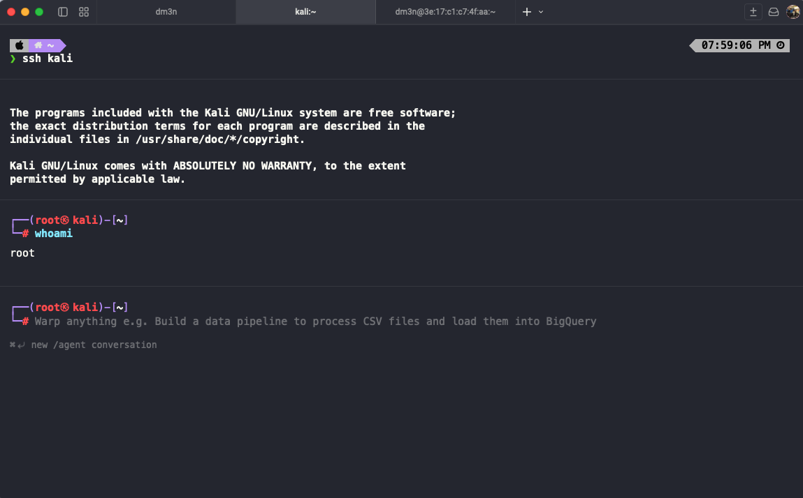

# Macintosh

Macintosh is my personal AI engineering OS — the complete system I use to build Airbank. It spans local development, a 6-agent coding pipeline, persistent knowledge memory, private cloud execution, and a 14-skill AI team on top of Claude Code.

Think of it as my custom version of [gstack](https://github.com/garrytan/gstack) — built for a fintech founder running multiple products simultaneously, tuned to my exact stack (Next.js 16, React 19, Supabase, GCP, shadcn/ui), and integrated with a self-hosted homelab and a persistent knowledge brain.

**The skills alone are worth the install.** 14 specialist Claude Code skills that cover the full development sprint — product interrogation, design review, live browser QA, OWASP security auditing, engineering retros, and more. All shadcn/ui-enforced, all Airbank-context-aware.

## Install — 30 seconds

```bash
curl -fsSL https://raw.githubusercontent.com/dm3n/macintosh/main/scripts/install.sh | bash
```

Or clone and bootstrap directly:

```bash
git clone https://github.com/dm3n/macintosh.git ~/lab/homelab-macintosh
cd ~/lab/homelab-macintosh
./scripts/bootstrap.sh
```

Restart Claude Code after install. Skills are immediately available via the Skill tool.

## What This Repository Is

This repo is the source of truth for:
- local development and agent standards
- PKB/Brain architecture and workflows
- personal cloud and homelab runtime design
- approval-gated automation model
- setup, operation, and expansion documentation

## System At A Glance

```text
Mac (Local Operator Layer)
  -> Superset terminal for coding
  -> Warp terminal for general terminal workflows
  -> Codex / Claude / Gemini / OpenCode
  -> PKB + Brain context and memory loop
  -> Tailscale secure mesh

Personal Cloud 2 (Infrastructure Layer)
  -> Proxmox cluster resource pool
  -> Kali VM (AI Repository + Cybersecurity node)
  -> Postgres + Redis

Control Layer
  -> Linear approval gate before external actions
```

## Visual Tour

### 1) Knowledge Layer (PKB Graph)


The Brain vault is the persistent knowledge engine that compounds across sessions, projects, and agents.

### 2) Infrastructure Layer (Proxmox + Kali Provisioning)


Proxmox hosts the personal cloud cluster where Kali and runtime services run as first-class infrastructure workloads.

### 3) Local Development Layer (Superset Coding Workspace)


Superset is the implementation-first coding surface for daily agent-driven development.

## 5-Layer Operating Model

| Layer | Function | Primary Docs |
|---|---|---|
| Build | Converts scoped work into tested, deployable output | [docs/development-workflow.md](docs/development-workflow.md), [docs/dev-environment.md](docs/dev-environment.md), [docs/local-development-system.md](docs/local-development-system.md) |
| Knowledge (PKB) | Converts raw input into reusable long-term memory | [docs/knowledge-brain.md](docs/knowledge-brain.md) |
| Execution (Homelab) | Runs infrastructure and automation workloads | [docs/homelab-architecture.md](docs/homelab-architecture.md), [docs/personal-cloud-cluster.md](docs/personal-cloud-cluster.md), [docs/setup.md](docs/setup.md) |
| Approval | Enforces human review before external delivery | [docs/approval-flow.md](docs/approval-flow.md) |
| Coordination | Aligns priorities, ownership, and communication | [docs/team-communication.md](docs/team-communication.md), [docs/agents.md](docs/agents.md), [docs/operator-workflows.md](docs/operator-workflows.md) |

## Runtime Architecture (Current)

Platform:
- Proxmox + Casa as server management foundation
- Docker workloads now, Kubernetes as part of the same platform strategy

Core workloads:
- `kali` VM: AI repository and cybersecurity node
- State services: Postgres + Redis

Control model:
- agents produce pending actions
- approval decisions happen in Linear
- executor delivers approved actions only
- audit trail is persisted for lifecycle transparency

## Kali Node Contract

Kali is a first-class Macintosh node for Linux-side AI and security operations.



Expected operator experience:
1. Open terminal (Superset or Warp).
2. Run `ssh kali`.
3. Land in Kali shell and operate immediately.

Reference: [docs/kali-ai-repository-node.md](docs/kali-ai-repository-node.md)

Kali operations helpers in this repo:
- `homelab/scripts/proxmox-api.sh` for token-based Proxmox API calls
- `homelab/scripts/sync-kali-opencode-to-brain.sh` for syncing OpenCode session exports into Brain raw conversations
- `homelab/scripts/gcp-model-host.sh` for controlling GCP GPU model-host lifecycle

GCP offload reference:
- [docs/kali-gcp-model-serving.md](docs/kali-gcp-model-serving.md)

## Homelab Runtime

After bootstrapping, bring the homelab stack up:

```bash
cd homelab
cp -n .env.example .env
# fill credentials
docker compose up -d --build
```

## Skills — Your AI Engineering Team

14 specialist Claude Code skills, installed globally at `~/.claude/skills/macintosh/`. Each skill runs in the context of your stack, your projects, and your standards. All design skills enforce shadcn/ui — no exceptions.

These complement [superpowers](https://github.com/obra/superpowers) and can be used alongside it. Superpowers handles core engineering discipline (brainstorming, TDD, debugging, code review, shipping). Macintosh skills handle the gaps: product thinking, design, live QA, security, and operations.

| Skill | Role | What it does |
|---|---|---|
| `/product-review` | **Founder / YC Partner** | Six forcing questions before you build anything. Challenges framing, finds the real pain, proposes alternatives. |
| `/autoplan` | **Architect** | Feature description → complete implementation plan, all files identified, risks noted, tasks broken out. |
| `/design-review` | **Senior Designer** | Audits UI for shadcn/ui compliance, Tailwind v4 patterns, fintech aesthetic, accessibility, mobile. Fixes inline. |
| `/plan-design-review` | **Design Reviewer** | Spec-level design audit before implementation. Checks shadcn/ui feasibility, component reuse, edge cases. |
| `/design-shotgun` | **Design Explorer** | Generates 4–6 UI variants as real shadcn/ui code. Collects feedback, iterates, produces a winner. |
| `/qa` | **QA Lead** | Opens a real browser, navigates flows like a user, finds and reports bugs CI misses. |
| `/devex-review` | **DX Auditor** | Tests borrower portal onboarding, apply wizard UX, dev setup — times every step, finds friction. |
| `/cso` | **Chief Security Officer** | OWASP Top 10 + STRIDE threat model, tuned for fintech (PII, mortgage data, Supabase auth, file uploads). |
| `/benchmark` | **Performance Engineer** | Lighthouse, Core Web Vitals, API response times, bundle size — with before/after comparison. |
| `/retro` | **Engineering Lead** | Weekly retro across all projects: commits, lines shipped, features delivered, next 3 priorities. |
| `/document-release` | **Release Engineer** | Git log → release notes in two formats: technical (Linear) and stakeholder-facing (partners). |
| `/canary` | **Deployment Lead** | Staged rollout plan with gate criteria, monitoring checkpoints, and copy-paste rollback commands. |
| `/careful` | **Risk Officer** | Explicit confirmation gate before any destructive operation — migrations, auth changes, production deploys. |
| `/browse` | **Researcher** | Real browser fetch for JS-rendered docs, competitor UX research, or any URL WebFetch can't handle. |

See [docs/skills.md](docs/skills.md) for full documentation on each skill.

## Repository Structure

```text
.
├── assets/                         # readme/doc visuals
│   └── screenshots/                # current architecture screenshots
├── docs/                           # system documentation
│   └── skills.md                   # full skill reference
├── skills/                         # macintosh Claude Code skills (source)
│   ├── qa.md                       # live browser QA
│   ├── cso.md                      # OWASP + STRIDE security audit
│   ├── retro.md                    # weekly engineering retrospective
│   ├── design-review.md            # shadcn/ui UI audit
│   ├── plan-design-review.md       # spec-level design review
│   ├── design-shotgun.md           # generate UI variants
│   ├── product-review.md           # YC-style product interrogation
│   ├── autoplan.md                 # feature → implementation plan
│   ├── browse.md                   # real browser research
│   ├── devex-review.md             # DX / onboarding audit
│   ├── benchmark.md                # Lighthouse + Core Web Vitals
│   ├── careful.md                  # risky operation gate
│   ├── canary.md                   # staged rollout planning
│   └── document-release.md         # release notes generator
├── homelab/
│   ├── docker-compose.yml          # runtime stack definition
│   ├── .env.example                # required env keys
│   ├── database/schema.sql         # queue/approval/audit schema
│   └── scripts/                    # deploy + tunnel scripts
├── scripts/
│   ├── install.sh                  # one-command install/update
│   ├── install-skills.sh           # installs skills to ~/.claude/skills/macintosh/
│   ├── bootstrap.sh                # local bootstrap
│   ├── validate-repo.sh            # repo consistency checks
│   └── scrub-commits.sh            # optional history utility
└── services/
    ├── orchestrator/
    ├── mcp-gateway/
    ├── approval-gateway/
    ├── executor/
    ├── agents/
    └── lib/
```

## Engineering Standards

- Use `shadcn/ui` for UI work
- Next.js 16 uses `proxy.ts` (not `middleware.ts`)
- Supabase key format: `sb_publishable_` / `sb_secret_`
- Default Gemini family: `gemini-3`
- Default Claude model: `claude-sonnet-4-6`

## Security + Delivery Boundaries

- agents draft actions; they do not directly execute external writes
- approval is required in Linear
- executor handles delivery only after approval
- secrets stay in `.env` and are never committed

## Documentation Index

Bird's-eye and product narrative:
- [docs/system-birdseye.md](docs/system-birdseye.md)
- [docs/operator-workflows.md](docs/operator-workflows.md)

Skills:
- [docs/skills.md](docs/skills.md)

Local development and agents:
- [docs/dev-environment.md](docs/dev-environment.md)
- [docs/local-development-system.md](docs/local-development-system.md)
- [docs/development-workflow.md](docs/development-workflow.md)
- [docs/agents.md](docs/agents.md)
- [docs/superpowers.md](docs/superpowers.md)

Infrastructure and execution:
- [docs/personal-cloud-cluster.md](docs/personal-cloud-cluster.md)
- [docs/homelab-architecture.md](docs/homelab-architecture.md)
- [docs/kali-ai-repository-node.md](docs/kali-ai-repository-node.md)
- [docs/install.md](docs/install.md)
- [docs/setup.md](docs/setup.md)

Knowledge and operating system context:
- [docs/knowledge-brain.md](docs/knowledge-brain.md)
- [docs/tech-stack.md](docs/tech-stack.md)
- [docs/team-communication.md](docs/team-communication.md)
- [docs/repository-roadmap.md](docs/repository-roadmap.md)

---

## Related

This engineering OS is the infrastructure behind the work catalogued in my
**[AI Systems Portfolio](https://github.com/dm3n/portfolio)** —
production AI platforms, the Symphony autonomous dev runner, and frontier-model
reasoning research.

## Contributing

See [CONTRIBUTING.md](CONTRIBUTING.md).

## License

MIT. See [LICENSE](LICENSE).

## Maintainer

Daniel Edgar — <daniel@nodebase.ca>

<sub>Last updated: June 2026</sub>
