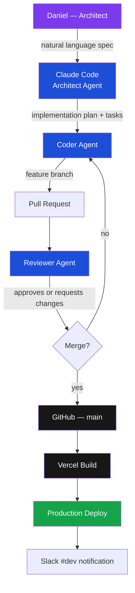

# Daniel Edgar — Macintosh Setup & Homelab

> Founder of [Airbank](https://github.com/dm3n/airbank) · AI-native M&A platform · Pre-seed

This repository is the single source of truth for how I build, ship, and run AI software companies. Airbank — covering the full stack from AI agent development and automated deployment, to a self-hosted 24/7 agent cluster, persistent knowledge management, and team coordination. Updated as the company evolves.

---

## Contents

| | |
|---|---|
| [Architecture](#architecture) | Full system overview |
| [Development Workflow](#development-workflow) | AI agent pipeline → GitHub → Vercel |
| [Homelab](#homelab) | Self-hosted Proxmox cluster + 24/7 agents |
| [Knowledge Brain](#knowledge-brain) | Obsidian persistent context system |
| [Team Communication](#team-communication) | Slack · Linear · Notion |
| [Tech Stack](#tech-stack) | Every tool, categorised |
| [Airbank Stack](#airbank-stack) | Platform architecture |

---

## Architecture

The full system has four layers that work together:

```
┌──────────────────────────────────────────────────────────────────────────┐
│                           DEVELOPMENT LAYER                               │
│                                                                            │
│   Daniel (Architect)                                                       │
│        │  natural language spec                                            │
│        ▼                                                                   │
│   Claude Code — Architect Agent                                            │
│        │  creates plan + tasks                                             │
│        ▼                                                                   │
│   Coder Agent ──► feature branch ──► Pull Request                         │
│                                           │                                │
│   Reviewer Agent ─────────────────► Review & Merge                        │
│                                           │                                │
│                          GitHub ◄─────────┘                               │
│                             │                                              │
│                          Vercel ──► Production (auto-deploy)              │
└────────────────────────────────────────────────────────────────────────────┘

┌──────────────────────────────────────────────────────────────────────────┐
│                            HOMELAB LAYER                                  │
│                                                                            │
│   2-Node Proxmox Cluster  ──  Docker  ──  Tailscale VPN                   │
│                                                                            │
│   24/7 agents: Code · Email · Calendar · Linear · Slack · Todo           │
│   All outputs → Telegram approval queue → Executor delivers              │
│   Morning briefing at 7AM with overnight work + pending approvals        │
└────────────────────────────────────────────────────────────────────────────┘

┌──────────────────────────────────────────────────────────────────────────┐
│                          KNOWLEDGE LAYER                                  │
│                                                                            │
│   Brain Vault (iCloud Obsidian)          Airbank Code Vault               │
│   ├── Memory/    AI context              ├── components/  (blue)          │
│   ├── Projects/  (purple)               ├── lib/          (green)         │
│   ├── Sessions/  (blue)                 ├── api/          (red)           │
│   ├── People/    (amber)                └── pages/        (purple)        │
│   └── Daily/     (orange)                                                  │
│                                          Auto-synced every 10min          │
└────────────────────────────────────────────────────────────────────────────┘

┌──────────────────────────────────────────────────────────────────────────┐
│                        COORDINATION LAYER                                 │
│                                                                            │
│   Slack ──── real-time + GitHub/Vercel/Linear webhooks                   │
│   Linear ─── dev tickets linked to GitHub branches and PRs               │
│   Notion ─── SOPs, meeting recordings, company knowledge base            │
└────────────────────────────────────────────────────────────────────────────┘
```

---

## Development Workflow

> Code is written by agents, reviewed by agents, deployed automatically. I architect — agents implement.



### Three Agent Roles

| Agent | Role | Trigger |
|-------|------|---------|
| **Architect** | Reads codebase, designs plan, coordinates | Every new feature or system change |
| **Coder** | Implements plan, writes tests, opens PR | During implementation |
| **Reviewer** | Reviews diff — bugs, security, style | Before every merge |

Agent definitions live in `.claude/agents/` inside each project repo.

### Branch Strategy

```
main ─────────────────────────────────── (production, protected)
  ├── feature/working-capital-peg
  ├── feature/legal-dd-module
  ├── fix/cell-patch-validation
  └── chore/vault-sync-script
```

Every push to `main` triggers a Vercel production deploy. All work goes through PRs — no direct commits to `main`.

### Linear → GitHub → Vercel Flow

```
Linear issue created
    │  branch name from issue slug
    ▼
Claude Code reads issue as context
    │
    ▼
Feature branch → PR (references Linear ID)
    │  auto-links in Linear
    ▼
PR merged → Linear issue closes → Vercel deploys → Slack #dev notified
```

→ [Full development workflow docs](docs/development-workflow.md)

---

## Homelab

> A self-hosted, always-on AI agent system on a 2-node Proxmox cluster. Accessible from any device via Tailscale VPN. Agents work 24/7 and surface everything as pending approvals — nothing acts without explicit approval.

### Cluster Architecture

```
┌──────────────────────────────────────────────────────────────────────┐
│                        PROXMOX CLUSTER                                │
│                                                                        │
│  ┌────────────────────────────────────────────────────────────────┐   │
│  │                    AGENT HUB (Docker Stack)                     │   │
│  │                                                                  │   │
│  │  ┌──────────────┐    ┌─────────────────────────────────────┐   │   │
│  │  │ ORCHESTRATOR │◄──►│          TELEGRAM BOT (24/7)         │   │   │
│  │  │  (Claude)    │    │  Morning briefing · Approve/Reject   │   │   │
│  │  └──────┬───────┘    └─────────────────────────────────────┘   │   │
│  │         │ dispatches                                             │   │
│  │    ┌────▼──────────────────────────────────────────┐           │   │
│  │    │                TASK QUEUE (Redis)              │           │   │
│  │    └───┬──────┬──────┬───────┬───────┬─────────────┘           │   │
│  │        │      │      │       │       │                          │   │
│  │   ┌────▼┐ ┌───▼─┐ ┌──▼──┐ ┌─▼────┐ ┌▼─────┐ ┌──────┐        │   │
│  │   │CODE │ │EMAIL│ │ CAL │ │LINEAR│ │SLACK │ │ TODO │        │   │
│  │   └─────┘ └─────┘ └─────┘ └──────┘ └──────┘ └──────┘        │   │
│  │                         │                                       │   │
│  │    ┌────────────────────▼─────────────────────┐               │   │
│  │    │           APPROVAL QUEUE (Postgres)       │               │   │
│  │    │        pending → approved / rejected      │               │   │
│  │    └────────────────────┬─────────────────────┘               │   │
│  │                         │ on approve                            │   │
│  │    ┌────────────────────▼─────────────────────┐               │   │
│  │    │              EXECUTOR SERVICE             │               │   │
│  │    │  GitHub PR  · Gmail send · GCal event     │               │   │
│  │    │  Linear issue · Slack post · Tasks        │               │   │
│  │    └───────────────────────────────────────────┘               │   │
│  │                                                                  │   │
│  │  ┌──────────────────────────────────────────────────────────┐  │   │
│  │  │                     MCP GATEWAY                           │  │   │
│  │  │  GitHub · Gmail · GCal · GTasks · Linear · Slack · FS    │  │   │
│  │  └──────────────────────────────────────────────────────────┘  │   │
│  └────────────────────────────────────────────────────────────────┘   │
│                                                                        │
│  Node 1 (Primary) ──────────── Node 2 (Warm Standby)                  │
└────────────────────────────────────────────────────────────────────────┘
              │
         Tailscale VPN
              │
    MacBook · iPhone · anywhere
```

### Approval Flow

```
Agent completes work
        │
        ▼
Draft stored in Postgres  (status: pending)
        │
        ▼
Telegram notification:
  "Code Agent drafted 2 fixes — [✅ Approve] [❌ Reject] [👁 View]"
        │
        ▼
Daniel approves on phone
        │
        ▼
Executor delivers:
  code     → GitHub PR opened
  email    → Gmail send
  calendar → Google Calendar event
  linear   → Linear issue created / updated
  slack    → Slack message posted
  tasks    → Google Tasks created
```

### Agents

| Agent | Monitors | Drafts | Schedule |
|-------|---------|--------|----------|
| **Orchestrator** | All inputs — Telegram, cron, webhooks | Routes + morning report | Always-on |
| **Code Agent** | All Airbank repos | Bug fixes, test gaps, PRs | Every 4h + on push |
| **Email Agent** | Gmail inbox | Reply drafts, urgent flags | Every 30min |
| **Calendar Agent** | Google Calendar | Conflict warnings, reschedules | Every 1h |
| **Linear Agent** | Linear Airbank HQ | Issue triage, sprint summaries | Every 2h |
| **Slack Agent** | #dev, #customers, #general | Digest, flagged threads | Every 1h |
| **Todo Agent** | Google Tasks | Priority sort, blocker flags | Every 2h |
| **Executor** | Approval queue | All approved action delivery | Event-driven |

### Morning Report (7:00 AM · Telegram)

```
☀️ Good morning Daniel — Thursday, April 3

📊 OVERNIGHT
  • Code Agent: 2 PRs drafted (Airbank Platform)
  • Email Agent: 11 threads processed, 3 drafts ready
  • Linear Agent: 4 new issues, sprint 67% complete
  • Slack Agent: 2 threads flagged in #customers

✅ PENDING APPROVAL — 7 items
  [View Queue]

📅 TODAY
  • 10:00 AM — Investor call (Antler)
  • 3:00 PM — Customer demo (Mark Simpson)

🎯 THIS WEEK  (Linear)
  • ENG-51: Working Capital Peg module
  • ENG-52: Legal DD contract extraction
  • ENG-48: Flags panel performance

What would you like to tackle first?
```

### Infrastructure

| Layer | Technology |
|-------|-----------|
| Hypervisor | Proxmox VE — 2-node cluster |
| Containers | Docker via `docker compose` over SSH |
| Remote access | **Tailscale VPN** — zero-config mesh, no open ports, no firewall rules |
| Secrets | `.env` on server, never committed |
| Monitoring | Docker health checks + Telegram alerts on failure |

### Homelab File Structure

```
homelab/
├── docker-compose.yml           # Full stack definition
├── .env.example                 # All required env vars
│
├── services/
│   ├── orchestrator/            # Claude orchestrator
│   ├── telegram-bot/            # Approval interface
│   ├── executor/                # Action delivery
│   ├── mcp-gateway/             # All external API tools
│   └── agents/
│       ├── code/                # Airbank repos — code review + PRs
│       ├── email/               # Gmail
│       ├── calendar/            # Google Calendar
│       ├── linear/              # Linear issues + sprints
│       ├── slack/               # Slack digests
│       └── todo/                # Google Tasks
│
├── database/
│   └── schema.sql               # Postgres schema
│
└── scripts/
    ├── deploy.sh                # Deploy to cluster via SSH
    └── ssh-tunnel.sh            # SSH tunnel helpers
```

→ [Full homelab architecture docs](docs/homelab-architecture.md)
→ [Server setup + Tailscale guide](docs/setup.md)
→ [Agent behaviour docs](docs/agents.md)
→ [Approval flow docs](docs/approval-flow.md)

---

## Knowledge Brain

> No context is ever lost. Every session, decision, and project note is captured in a structured, linked graph — readable by any AI model at any time.


### Two Obsidian Vaults

**Brain Vault** — personal knowledge base, synced via iCloud
```
Brain/
├── Memory/          # AI agent memory — loaded at every Claude Code session
├── Projects/        # Per-project notes + Airbank road-to-$1B plan
├── Claude Sessions/ # Every Claude Code session auto-saved
├── Claude Web Chats/# claude.ai conversations auto-exported nightly
├── Apple Notes/     # iPhone/Mac notes exported nightly
├── People/          # Investors, advisors, customers
├── Airbank/         # Company hub with dataview queries
├── Daily/           # Daily notes
└── System/          # Automation scripts + LaunchAgents
```

**Airbank Code Vault** — live codebase as a graph, auto-synced every 10min
```
Airbank/
├── Airbank Platform/    # 137 notes — one per source file
│   ├── app/api/         # API routes (red nodes)
│   ├── components/      # UI components (blue nodes)
│   └── lib/             # Library modules (green nodes)
└── Airbank Website/     # 19 notes
```

174 linked notes. Import relationships become wikilinks — the graph shows live dependency connections across the entire codebase.

### Graph Colour Legend

| Brain Vault | | Airbank Vault | |
|-------------|---|---------------|---|
| Cyan | MOC hub notes | Purple | Pages |
| Green | Memory | Blue | Components |
| Purple | Projects | Red | API routes |
| Blue | Claude Sessions | Green | Library |
| Orange | Daily + Inbox | Amber | Hooks |
| Pink | Apple Notes | Cyan | Index hubs |
| Amber | People | | |
| Red | Airbank | | |

### Automation

| Script | Schedule | What it does |
|--------|----------|-------------|
| `sync-vault.py` | Every 10min (LaunchAgent) | `git pull` both Airbank repos → scan all TS/TSX → regenerate 174 notes |
| `export-brain.sh` | Nightly (LaunchAgent) | Export Apple Notes + git summaries → Brain vault |
| Claude Code memory | Every session | Reads `Memory/MEMORY.md`, writes new context on completion |

→ [Full knowledge brain docs](docs/knowledge-brain.md)

---

## Team Communication

```
Slack  ──── real-time communication + GitHub / Vercel / Linear webhooks
Linear ──── dev sprints, issues linked to GitHub branches and PRs
Notion ──── SOPs, meeting recordings, company knowledge base
```

### Flow

```
Customer call → Notion (auto-transcript)
                    │
                    ├──► Linear issue → Claude Code → PR → Deploy → Slack #dev
                    │
                    └──► Key decisions → Obsidian Brain Memory
                                              │
                                         Available in every future Claude session
```

### Slack Channels

| Channel | Purpose |
|---------|---------|
| `#dev` | GitHub PRs, Vercel deploys, Linear updates |
| `#general` | Company-wide |
| `#customers` | Deal updates, LOI tracking, customer conversations |
| `#ops` | Finance, legal, admin |

→ [Full team communication docs](docs/team-communication.md)

---

## Tech Stack

### AI & Intelligence

| Tool | Role |
|------|------|
| **Claude Code** | Primary dev environment — AI agent pipeline (architect → coder → reviewer) |
| **Claude (claude.ai)** | Strategy, writing, research, complex reasoning |
| **Gemini 2.0 Flash** | In-product AI — QoE document extraction via Vertex AI |
| **Perplexity** | Live internet research — competitors, news, market intel |

### Code & Deployment

| Tool | Role |
|------|------|
| **GitHub** | All repos — private (Airbank products) + public (open source) |
| **Vercel** | Auto-deploy on push to `main`, preview URLs per PR |
| **Linear** | Dev sprints, issues, roadmap — GitHub PR integration |
| **Warp + Zsh** | Terminal — AI command suggestions, persistent history, split panes |

### Knowledge

| Tool | Role |
|------|------|
| **Obsidian** | Persistent AI brain — cross-session memory, graph-linked notes |
| **Notion** | Team wiki — SOPs, meeting recordings, shared docs |
| **Apple Notes** | Quick capture — exported nightly to Brain vault |

### Communication & Growth

| Tool | Role |
|------|------|
| **Slack** | Team communication + all webhooks (GitHub, Vercel, Linear) |
| **LinkedIn Premium + Sales Nav** | Investor and enterprise outreach |
| **Dripify** | Automated LinkedIn outreach sequences |
| **ManyChat** | Social media automation and DM flows |
| **Instagram (verified)** | Brand presence |

### Design & Finance

| Tool | Role |
|------|------|
| **Framer** | Marketing website frontend |
| **shadcn/ui** | All product UI — universal rule across every project |
| **QuickBooks** | Accounting, invoicing, expenses |
| **Venn** | Digital corporate cards + business banking |

### Infrastructure

| Tool | Role |
|------|------|
| **Google Cloud Platform** | Vertex AI, Cloud Storage, GCP project management |
| **Supabase** | PostgreSQL + Auth + Storage — all Airbank products |
| **Proxmox** | 2-node bare-metal hypervisor |
| **Docker** | All homelab services and agents containerised |
| **Tailscale** | VPN mesh — zero-config secure cluster access from anywhere |

→ [Full tech stack docs](docs/tech-stack.md)

---

## Airbank Stack

> AI-native M&A platform automating Quality of Earnings. QoE costs $25k–$250k and takes 6 weeks. Airbank does it in 48 hours, one click.

```
Next.js 16 · React 19 · TypeScript · Tailwind v4 · shadcn/ui
Supabase (PostgreSQL + Auth + Storage)
Google Cloud Storage · Vertex AI RAG · Gemini 2.0 Flash
Anthropic Claude (AI chat) · Recharts · SheetJS
Vercel
```

### Products

**Quality of Earnings** — 11-section AI workbook. Upload financials → AI extracts every line item, cites sources, flags low-confidence values, full audit trail. Export to Excel / Google Sheets / PDF.

**Data Room** — AI-augmented document collection. Diligence checklist builder, counterparty data requests, RAG-powered chat over all uploaded documents.

### Architecture

```
Browser → Next.js App Router (Vercel)
               │
    ┌──────────┼────────────┐
    ▼          ▼            ▼
Supabase   Vertex AI    Google Cloud
(DB/Auth)  (Gemini +    Storage
           RAG Corpus)  (Documents)
```

**Live demo:** https://airbank-platform.vercel.app
Login: `user@test.com` / `TestPass123!`

→ [Full Airbank stack docs](docs/airbank-stack.md)
→ [Platform repo](https://github.com/dm3n/airbank) (private)

---

## Repositories

| Repo | Description |
|------|-------------|
| [macintosh](https://github.com/dm3n/macintosh) | This repo — full engineering OS |
| [airbank](https://github.com/dm3n/airbank) | QoE Platform — Next.js 16 + Gemini + RAG (private) |
| [airbank-lander](https://github.com/dm3n/airbank-lander) | Marketing site (private) |
| [VisionClaw-Meta-SDK](https://github.com/dm3n/VisionClaw-Meta-SDK) | AI vision for Meta Ray-Bans |
| [rogi-v2](https://github.com/dm3n/rogi-v2) | AI-native mortgage intake |
| [uncertainty-propagation](https://github.com/dm3n/uncertainty-propagation) | Research paper |

---

## Contact

**Daniel Edgar** · Founder, Airbank
[daniel@nodebase.ca](mailto:daniel@nodebase.ca)

---

*Updated as the company evolves — last updated April 2026*
