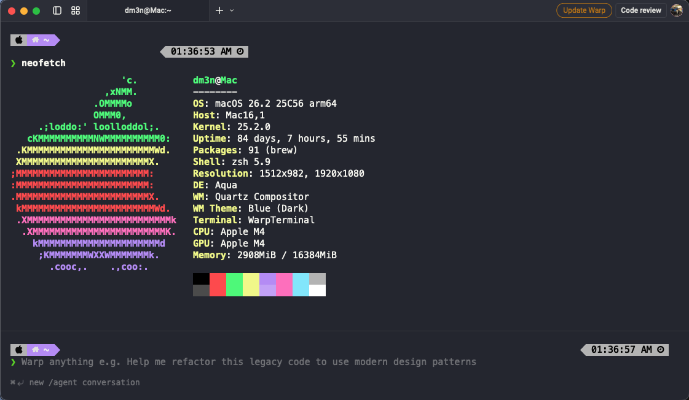
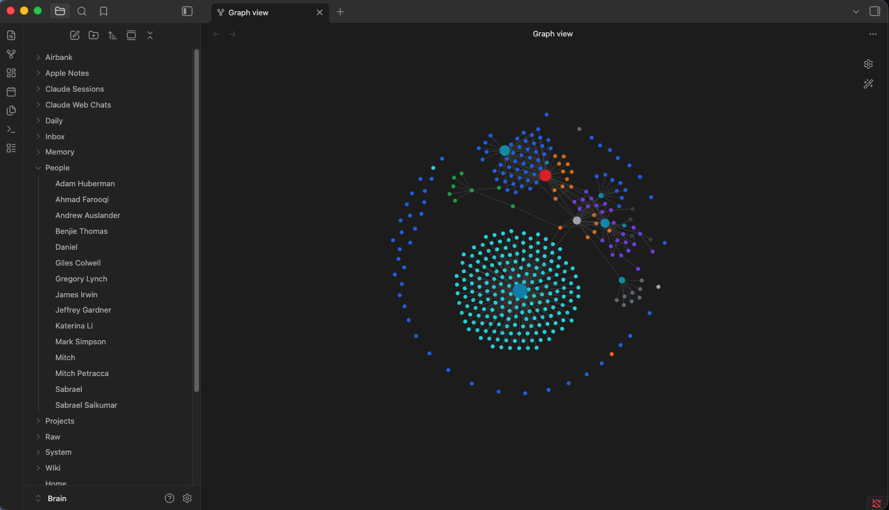

# Daniel Ray Edgar — Macintosh + Claude + Homelab

> Founder of [Airbank](https://airbank.ca) · AI-native M&A platform · Pre-seed

This repository is the single source of truth for how I build, ship, and run AI software companies. Everything from the AI agent development pipeline and automated deployment, to a self-hosted 24/7 agent cluster, a personal knowledge brain that compounds across every conversation, and full team coordination. Updated as the company evolves.

---

## Contents

| | |
|---|---|
| [Architecture](#architecture) | Full five-layer system overview |
| [Development Workflow](#development-workflow) | Six-agent pipeline → GitHub → Vercel |
| [Personal Knowledge Brain](#personal-knowledge-brain) | Raw → Process → Wiki → Query |
| [Homelab](#homelab) | Self-hosted Proxmox cluster + 24/7 agents |
| [Knowledge Brain (Obsidian)](#knowledge-brain-obsidian) | Persistent context system |
| [Team Communication](#team-communication) | Slack · Linear · Notion |
| [Tech Stack](#tech-stack) | Every tool, categorised |
| [Airbank Stack](#airbank-stack) | Platform architecture |



---

## Architecture

The full system has five layers that work together. Every layer feeds every other.

```
┌──────────────────────────────────────────────────────────────────────────┐
│                         DEVELOPMENT LAYER                                 │
│                                                                            │
│   Daniel  ──► Plan Agent ──► Code Agent ──► Test Agent ──► QA Agent      │
│   (spec)          │                                            │            │
│                   └──────────────────────────────────────────►│            │
│                                                          Review Agent      │
│                                                                │            │
│                                              PR ──► GitHub ──► Vercel     │
└────────────────────────────────────────────────────────────────────────────┘

┌──────────────────────────────────────────────────────────────────────────┐
│                    PERSONAL KNOWLEDGE BRAIN LAYER                         │
│                                                                            │
│   Raw Sources ──► PKB Processor ──► Wiki                                  │
│   (drop zone)      (Claude)       Entities · Concepts · SOPs              │
│                                         │                                  │
│   PKB Query ◄──────────────────────────┘                                  │
│   (any question → Brain answers → good answers → back to Wiki)            │
└────────────────────────────────────────────────────────────────────────────┘

┌──────────────────────────────────────────────────────────────────────────┐
│                           HOMELAB LAYER                                   │
│                                                                            │
│   2-Node Proxmox Cluster  ──  Docker  ──  Tailscale VPN                   │
│                                                                            │
│   24/7 agents: Code · Email · Calendar · Linear · Slack · Todo           │
│   All outputs → Telegram approval queue → Executor delivers              │
│   Morning briefing at 7AM with overnight work + pending approvals        │
└────────────────────────────────────────────────────────────────────────────┘

┌──────────────────────────────────────────────────────────────────────────┐
│                          KNOWLEDGE LAYER                                  │
│                                                                            │
│   Brain Vault (iCloud Obsidian)          Airbank Code Vault               │
│   ├── Raw/       drop zone              ├── components/  (blue)           │
│   ├── Wiki/      compiled knowledge     ├── lib/          (green)         │
│   ├── Memory/    AI context             ├── api/          (red)           │
│   ├── Sessions/  (blue)                 └── pages/        (purple)        │
│   └── People/    (amber)                                                   │
│                                          Auto-synced every 10min          │
└────────────────────────────────────────────────────────────────────────────┘

┌──────────────────────────────────────────────────────────────────────────┐
│                        COORDINATION LAYER                                 │
│                                                                            │
│   Slack ──── real-time + GitHub/Vercel/Linear webhooks                   │
│   Linear ─── dev tickets linked to GitHub branches and PRs               │
│   Notion ─── SOPs, meeting recordings, company knowledge base            │
└────────────────────────────────────────────────────────────────────────────┘
```

---

## Development Workflow

> Specs become features without touching code. I architect — agents plan, implement, test, review, and ship.

### Five-Agent Pipeline

```
┌──────────────────────────────────────────────────────────────────────────┐
│                        SIGNAL (Input)                                     │
│                                                                            │
│   Linear issue  ·  Slack thread  ·  Claude Chat spec  ·  voice note      │
└──────────────────────────────┬───────────────────────────────────────────┘
                               │
                               ▼
┌──────────────────────────────────────────────────────────────────────────┐
│                          PLAN AGENT                                       │
│                                                                            │
│   • Reads full codebase + Linear context + Brain memory                  │
│   • Produces: spec.md · task list · risk flags · affected files          │
│   • Blocks if spec is ambiguous — asks Daniel before writing code        │
└──────────────────────────────┬───────────────────────────────────────────┘
                               │  approved plan
                               ▼
┌──────────────────────────────────────────────────────────────────────────┐
│                          CODE AGENT                                       │
│                                                                            │
│   • Implements plan on a feature branch                                  │
│   • Writes unit + integration tests alongside every file changed         │
│   • Uses shadcn/ui universally · follows all CLAUDE.md rules             │
│   • Commits atomically with clear messages                               │
└──────────────────────────────┬───────────────────────────────────────────┘
                               │  code written
                               ▼
┌──────────────────────────────────────────────────────────────────────────┐
│                           QA AGENT                                        │
│                                                                            │
│   • Runs full test suite · coverage report · fails fast on regressions   │
│   • End-to-end Playwright tests · visual regression checks               │
│   • API contract validation · performance budget · accessibility scan    │
└──────────────────────────────┬───────────────────────────────────────────┘
                               │  all green
                               ▼
┌──────────────────────────────────────────────────────────────────────────┐
│                         REVIEW AGENT                                      │
│                                                                            │
│   • Full diff review: correctness · security · performance · style       │
│   • Checks for OWASP top 10, injection vectors, secrets in code          │
│   • Verifies tests cover all changed logic                               │
│   • Approves PR or returns specific change requests to Code Agent        │
└──────────────────────────────┬───────────────────────────────────────────┘
                               │  approved
                               ▼
┌──────────────────────────────────────────────────────────────────────────┐
│                        MERGE & SHIP                                       │
│                                                                            │
│   PR merged → Vercel deploy → Slack #dev notify                          │
│   Linear issue auto-closes · Brain session auto-saved                    │
│   PKB extracts key decisions → Brain/Wiki/                               │
└──────────────────────────────────────────────────────────────────────────┘
```

### Agent Definitions

| Agent | Core Responsibility | Key Output |
|-------|-------------------|------------|
| **Plan** | Translate spec → implementation blueprint | `spec.md` · task list · risk flags |
| **Code** | Write production code | Feature branch · commits |
| **QA** | Test suite + end-to-end Playwright + regression | Pass/fail · coverage · regression report |
| **Review** | Code quality + security gate | Approval or change requests |
| **Merge** | Ship to production | PR merged · deploy · notifications |

Agent definitions live in `.claude/agents/` inside each project repo.

### Branch Strategy

```
main ─────────────────────────────────── (production, protected)
  ├── feature/working-capital-peg
  ├── feature/legal-dd-module
  ├── fix/cell-patch-validation
  └── chore/vault-sync-script
```

Every push to `main` triggers a Vercel production deploy. All work goes through PRs — no direct commits to `main`.

### Linear → GitHub → Vercel Flow

```
Linear issue created
    │  branch name from issue slug
    ▼
Plan Agent reads issue as context
    │
    ▼
Feature branch → Code Agent → Tests → QA → Review → PR
    │  references Linear ID
    ▼
PR merged → Linear issue closes → Vercel deploys → Slack #dev notified
              → Brain session saved → PKB processes insights
```

→ [Full development workflow docs](docs/development-workflow.md) 

---

## Personal Knowledge Brain

> Every article, call note, meeting, idea, and research paper I consume gets compiled into a living wiki that answers questions, surfaces connections, and gets smarter with every conversation.



### The Problem It Solves

I read hundreds of sources a week — news, blog posts, investor calls, customer conversations, research. Without a system, 95% evaporates. With this system, every source is processed, linked, and queryable forever.

### Four-Phase Pipeline

```
┌──────────────────────────────────────────────────────────────────────────┐
│                         PHASE 1: RAW DROP ZONE                           │
│                                                                            │
│   Brain/Raw/                                                               │
│   ├── News/          articles · market intel · competitor updates        │
│   ├── Blog/          essays · frameworks · thought leadership            │
│   ├── Personal/      reflections · ideas · journal entries               │
│   ├── Company/       meeting notes · decisions · customer intel          │
│   ├── Research/      papers · reports · deep analysis                    │
│   ├── Conversations/ call transcripts · interview notes · chats          │
│   └── Inbox/         unsorted drop zone (auto-classified)                │
│                                                                            │
│   Drop a file here. That's it.                                            │
└──────────────────────────────┬───────────────────────────────────────────┘
                               │
                               ▼
┌──────────────────────────────────────────────────────────────────────────┐
│                      PHASE 2: LLM COMPILER                                │
│                                                                            │
│   pkb-process.py  (runs nightly + on-demand)                             │
│                                                                            │
│   For each raw file:                                                       │
│   1. Detect source type (news / blog / personal / company / research)    │
│   2. Load PKB schema (Brain/System/PKB/schema.md) — processing rules     │
│   3. Call Claude: summarise · extract entities · find cross-refs         │
│   4. Write output to Wiki/ · archive original to Raw/Processed/          │
│                                                                            │
│   Schema defines: summary length · entity rules · SOP triggers ·        │
│   cross-reference rules · page templates · quality standards             │
└──────────────────────────────┬───────────────────────────────────────────┘
                               │
                               ▼
┌──────────────────────────────────────────────────────────────────────────┐
│                        PHASE 3: COMPILED WIKI                             │
│                                                                            │
│   Brain/Wiki/                                                              │
│   ├── Entities/                                                            │
│   │   ├── People/        one page per person — context · interactions    │
│   │   └── Companies/     one page per company — relevance to Airbank     │
│   ├── Concepts/           mental models · frameworks · principles        │
│   ├── Frameworks/         structured playbooks (Go-to-Market etc.)       │
│   ├── SOPs/               standard operating procedures                  │
│   ├── Summaries/          source summaries with wikilinks                │
│   └── Compiled/           Q&A answers saved from queries                 │
│                                                                            │
│   Every page links to related pages. Obsidian graph shows the web.       │
└──────────────────────────────┬───────────────────────────────────────────┘
                               │
                               ▼
┌──────────────────────────────────────────────────────────────────────────┐
│                       PHASE 4: QUERY & COMMAND                            │
│                                                                            │
│   pkb-query.py — ask any question across 400K+ documents                 │
│                                                                            │
│   $ pkb-query "what does Andrew Auslander look for in investments?"      │
│   $ pkb-query "summarise everything we know about private credit"        │
│   $ pkb-query "what are the open action items from customer calls?"      │
│                                                                            │
│   Searches: Wiki/ · Memory/ · People/ · Projects/ · Sessions/            │
│   Good answers: saved to Wiki/Compiled/ · fed back into the graph        │
└──────────────────────────────────────────────────────────────────────────┘
```

### Feedback Loop

Every conversation makes the Brain smarter:

```
Claude Code session ends
    │  Stop hook fires
    ▼
Brain/Claude Sessions/[date-project-title].md saved

    + PKB extracts decisions, insights, entity updates from session
    ▼
Brain/Wiki/ updated (person pages · concept pages · compiled answers)

    +
Claude Chat (claude.ai)
    │  bookmarklet export
    ▼
Brain/Claude Web Chats/ → nightly brain-sync connects wikilinks
    ▼
All future sessions load richer context
```

### PKB Commands

```bash
# Process all pending Raw/ files
python3 ~/.claude/scripts/pkb-process.py

# Dry run — see what would be processed
python3 ~/.claude/scripts/pkb-process.py --dry-run

# Process a single file
python3 ~/.claude/scripts/pkb-process.py --file ~/Desktop/article.md

# Query the Brain
python3 ~/.claude/scripts/pkb-query.py "your question"

# Query and save the answer to Wiki/Compiled/
python3 ~/.claude/scripts/pkb-query.py "your question" --save

# Interactive query REPL
python3 ~/.claude/scripts/pkb-query.py --interactive
```

### PKB Schema

The schema (`Brain/System/PKB/schema.md`) defines exactly how the LLM processes each source type:
- **Summary format** — length, structure, bullet style per source type
- **Entity extraction rules** — what to pull out and where to put it
- **Page templates** — Person, Company, Concept, SOP
- **Cross-reference rules** — how to link to existing notes
- **SOP triggers** — when to automatically generate a process page
- **Quality standards** — precision over volume, never hallucinate, action-orientation

→ [PKB Schema](Brain/System/PKB/schema.md)

---

## Homelab

> A self-hosted, always-on AI agent system on a 2-node Proxmox cluster. Accessible from any device via Tailscale VPN. Agents work 24/7 and surface everything as pending approvals — nothing acts without explicit approval.

### Cluster Architecture

```
┌──────────────────────────────────────────────────────────────────────┐
│                        PROXMOX CLUSTER                                │
│                                                                        │
│  ┌────────────────────────────────────────────────────────────────┐   │
│  │                    AGENT HUB (Docker Stack)                     │   │
│  │                                                                  │   │
│  │  ┌──────────────┐    ┌─────────────────────────────────────┐   │   │
│  │  │ ORCHESTRATOR │◄──►│          TELEGRAM BOT (24/7)         │   │   │
│  │  │  (Claude)    │    │  Morning briefing · Approve/Reject   │   │   │
│  │  └──────┬───────┘    └─────────────────────────────────────┘   │   │
│  │         │ dispatches                                             │   │
│  │    ┌────▼──────────────────────────────────────────┐           │   │
│  │    │                TASK QUEUE (Redis)              │           │   │
│  │    └───┬──────┬──────┬───────┬───────┬─────────────┘           │   │
│  │        │      │      │       │       │                          │   │
│  │   ┌────▼┐ ┌───▼─┐ ┌──▼──┐ ┌─▼────┐ ┌▼─────┐ ┌──────┐        │   │
│  │   │CODE │ │EMAIL│ │ CAL │ │LINEAR│ │SLACK │ │ TODO │        │   │
│  │   └─────┘ └─────┘ └─────┘ └──────┘ └──────┘ └──────┘        │   │
│  │                         │                                       │   │
│  │    ┌────────────────────▼─────────────────────┐               │   │
│  │    │           APPROVAL QUEUE (Postgres)       │               │   │
│  │    │        pending → approved / rejected      │               │   │
│  │    └────────────────────┬─────────────────────┘               │   │
│  │                         │ on approve                            │   │
│  │    ┌────────────────────▼─────────────────────┐               │   │
│  │    │              EXECUTOR SERVICE             │               │   │
│  │    │  GitHub PR  · Gmail send · GCal event     │               │   │
│  │    │  Linear issue · Slack post · Tasks        │               │   │
│  │    └───────────────────────────────────────────┘               │   │
│  │                                                                  │   │
│  │  ┌──────────────────────────────────────────────────────────┐  │   │
│  │  │                     MCP GATEWAY                           │  │   │
│  │  │  GitHub · Gmail · GCal · GTasks · Linear · Slack · FS    │  │   │
│  │  └──────────────────────────────────────────────────────────┘  │   │
│  └────────────────────────────────────────────────────────────────┘   │
│                                                                        │
│  Node 1 (Primary) ──────────── Node 2 (Warm Standby)                  │
└────────────────────────────────────────────────────────────────────────┘
              │
         Tailscale VPN
              │
    MacBook · iPhone · anywhere
```

### Approval Flow

```
Agent completes work
        │
        ▼
Draft stored in Postgres  (status: pending)
        │
        ▼
Telegram notification:
  "Code Agent drafted 2 fixes — [✅ Approve] [❌ Reject] [👁 View]"
        │
        ▼
Daniel approves on phone
        │
        ▼
Executor delivers:
  code     → GitHub PR opened
  email    → Gmail send
  calendar → Google Calendar event
  linear   → Linear issue created / updated
  slack    → Slack message posted
  tasks    → Google Tasks created
```

### Agents

| Agent | Monitors | Drafts | Schedule |
|-------|---------|--------|----------|
| **Orchestrator** | All inputs — Telegram, cron, webhooks | Routes + morning report | Always-on |
| **Code Agent** | All Airbank repos | Bug fixes, test gaps, PRs | Every 4h + on push |
| **Email Agent** | Gmail inbox | Reply drafts, urgent flags | Every 30min |
| **Calendar Agent** | Google Calendar | Conflict warnings, reschedules | Every 1h |
| **Linear Agent** | Linear Airbank HQ | Issue triage, sprint summaries | Every 2h |
| **Slack Agent** | #dev, #customers, #general | Digest, flagged threads | Every 1h |
| **Todo Agent** | Google Tasks | Priority sort, blocker flags | Every 2h |
| **Executor** | Approval queue | All approved action delivery | Event-driven |

### Morning Report (7:00 AM · Telegram)

```
☀️ Good morning Daniel — Thursday, April 3

📊 OVERNIGHT
  • Code Agent: 2 PRs drafted (Airbank Platform)
  • Email Agent: 11 threads processed, 3 drafts ready
  • Linear Agent: 4 new issues, sprint 67% complete
  • Slack Agent: 2 threads flagged in #customers
  • PKB: 7 Raw files processed → 3 people · 2 companies · 1 SOP

✅ PENDING APPROVAL — 7 items
  [View Queue]

📅 TODAY
  • 10:00 AM — Investor call (Antler)
  • 3:00 PM — Customer demo (Mark Simpson)

🎯 THIS WEEK  (Linear)
  • ENG-51: Working Capital Peg module
  • ENG-52: Legal DD contract extraction
  • ENG-48: Flags panel performance

What would you like to tackle first?
```

### Infrastructure

| Layer | Technology |
|-------|-----------|
| Hypervisor | Proxmox VE — 2-node cluster |
| Containers | Docker via `docker compose` over SSH |
| Remote access | **Tailscale VPN** — zero-config mesh, no open ports, no firewall rules |
| Secrets | `.env` on server, never committed |
| Monitoring | Docker health checks + Telegram alerts on failure |

### Homelab File Structure

```
homelab/
├── docker-compose.yml           # Full stack definition
├── .env.example                 # All required env vars
│
├── services/
│   ├── orchestrator/            # Claude orchestrator
│   ├── telegram-bot/            # Approval interface
│   ├── executor/                # Action delivery
│   ├── mcp-gateway/             # All external API tools
│   └── agents/
│       ├── code/                # Airbank repos — code review + PRs
│       ├── email/               # Gmail
│       ├── calendar/            # Google Calendar
│       ├── linear/              # Linear issues + sprints
│       ├── slack/               # Slack digests
│       └── todo/                # Google Tasks
│
├── database/
│   └── schema.sql               # Postgres schema
│
└── scripts/
    ├── deploy.sh                # Deploy to cluster via SSH
    └── ssh-tunnel.sh            # SSH tunnel helpers
```

→ [Full homelab architecture docs](docs/homelab-architecture.md)
→ [Server setup + Tailscale guide](docs/setup.md)
→ [Agent behaviour docs](docs/agents.md)
→ [Approval flow docs](docs/approval-flow.md)

---

## Knowledge Brain (Obsidian)

> No context is ever lost. Every session, decision, article, and conversation is captured in a structured, linked graph — readable by any AI model at any time.

### Two Obsidian Vaults

**Brain Vault** — personal knowledge base, synced via iCloud
```
Brain/
├── Raw/             # PKB drop zone — sources waiting to be compiled
│   ├── News/        # Articles, market intel
│   ├── Blog/        # Essays, posts
│   ├── Personal/    # Reflections, journal
│   ├── Company/     # Meeting notes, decisions
│   ├── Research/    # Papers, reports
│   ├── Conversations/ # Call transcripts, chats
│   ├── Inbox/       # Unsorted
│   └── Processed/   # Archived after PKB processing
├── Wiki/            # Compiled knowledge — built by PKB Processor
│   ├── Entities/    # People · Companies
│   ├── Concepts/    # Mental models · frameworks
│   ├── SOPs/        # Standard operating procedures
│   ├── Summaries/   # Source summaries with wikilinks
│   └── Compiled/    # Saved PKB query answers
├── Memory/          # AI agent memory — loaded at every Claude Code session
├── Projects/        # Per-project notes + Airbank road-to-$1B plan
├── Claude Sessions/ # Every Claude Code session auto-saved
├── Claude Web Chats/# claude.ai conversations auto-exported nightly
├── Apple Notes/     # iPhone/Mac notes exported nightly
├── People/          # Investors, advisors, customers
├── Airbank/         # Company hub with dataview queries
├── Daily/           # Daily notes
└── System/          # Automation scripts + LaunchAgents + PKB schema
```

**Airbank Code Vault** — live codebase as a graph, auto-synced every 10min
```
Airbank/
├── Airbank Platform/    # 137 notes — one per source file
│   ├── app/api/         # API routes (red nodes)
│   ├── components/      # UI components (blue nodes)
│   └── lib/             # Library modules (green nodes)
└── Airbank Website/     # 19 notes
```

### Automation

| Script | Schedule | What it does |
|--------|----------|-------------|
| `pkb-process.py` | Nightly + on-demand | Processes Raw/ inbox → compiles Wiki/ pages |
| `pkb-query.py` | On-demand | Natural language query across entire Brain |
| `sync-vault.py` | Every 10min (LaunchAgent) | `git pull` both Airbank repos → regenerate 174 code notes |
| `brain-sync.sh` | Nightly 2am (LaunchAgent) | Export Apple Notes + git + PKB processing + connect wikilinks |
| `save-session-to-brain.py` | Every session (Stop hook) | Save Claude Code session to Brain/Claude Sessions/ |
| `sync-claude-chats.py` | Nightly | Export claude.ai web chats to Brain/Claude Web Chats/ |

→ [Full knowledge brain docs](docs/knowledge-brain.md)

---

## Team Communication

```
Slack  ──── real-time communication + GitHub / Vercel / Linear webhooks
Linear ──── dev sprints, issues linked to GitHub branches and PRs
Notion ──── SOPs, meeting recordings, company knowledge base
```

### Flow

```
Customer call → Notion (auto-transcript)
                    │
                    ├──► Linear issue → Plan Agent → Code → Test → QA → Review → Deploy → Slack #dev
                    │
                    ├──► Key decisions → Brain/Wiki/ (via PKB Company drop)
                    │
                    └──► Key decisions → Obsidian Brain Memory
                                              │
                                         Available in every future Claude session
```

### Slack Channels

| Channel | Purpose |
|---------|---------|
| `#dev` | GitHub PRs, Vercel deploys, Linear updates |
| `#general` | Company-wide |
| `#customers` | Deal updates, LOI tracking, customer conversations |
| `#ops` | Finance, legal, admin |

→ [Full team communication docs](docs/team-communication.md)

---

## Tech Stack

### AI & Intelligence

| Tool | Role |
|------|------|
| **Claude Code** | Primary dev environment — six-agent pipeline (plan → code → test → QA → review → ship) |
| **Claude (claude.ai)** | Strategy, writing, research, complex reasoning |
| **PKB Query** | Cross-session knowledge synthesis — ask anything across 400K+ Brain documents |
| **Gemini 2.0 Flash** | In-product AI — QoE document extraction via Vertex AI |
| **Perplexity** | Live internet research — competitors, news, market intel |

### Code & Deployment

| Tool | Role |
|------|------|
| **GitHub** | All repos — private (Airbank products) + public (open source) |
| **Vercel** | Auto-deploy on push to `main`, preview URLs per PR |
| **Linear** | Dev sprints, issues, roadmap — GitHub PR integration |
| **Warp + Zsh** | Terminal — AI command suggestions, persistent history, split panes |

### Knowledge

| Tool | Role |
|------|------|
| **Obsidian (Brain Vault)** | Personal knowledge brain — Raw drop zone + compiled Wiki + persistent AI memory |
| **Obsidian (Code Vault)** | Live codebase as a graph — 174 auto-generated notes, import-linked |
| **Notion** | Team wiki — SOPs, meeting recordings, shared docs |
| **Apple Notes** | Quick capture — exported nightly to Brain vault |

### Communication & Growth

| Tool | Role |
|------|------|
| **Slack** | Team communication + all webhooks (GitHub, Vercel, Linear) |
| **LinkedIn Premium + Sales Nav** | Investor and enterprise outreach |
| **Dripify** | Automated LinkedIn outreach sequences |
| **ManyChat** | Social media automation and DM flows |
| **Instagram (verified)** | Brand presence |

### Design & Finance

| Tool | Role |
|------|------|
| **Framer** | Marketing website frontend |
| **shadcn/ui** | All product UI — universal rule across every project |
| **QuickBooks** | Accounting, invoicing, expenses |
| **Venn** | Digital corporate cards + business banking |

### Infrastructure

| Tool | Role |
|------|------|
| **Google Cloud Platform** | Vertex AI, Cloud Storage, GCP project management |
| **Supabase** | PostgreSQL + Auth + Storage — all Airbank products |
| **Proxmox** | 2-node bare-metal hypervisor |
| **Docker** | All homelab services and agents containerised |
| **Tailscale** | VPN mesh — zero-config secure cluster access from anywhere |

→ [Full tech stack docs](docs/tech-stack.md)

---

## Airbank Stack

> AI-native M&A platform automating Quality of Earnings. QoE costs $25k–$250k and takes 6 weeks. Airbank does it in 48 hours, one click.

```
Next.js 16 · React 19 · TypeScript · Tailwind v4 · shadcn/ui
Supabase (PostgreSQL + Auth + Storage)
Google Cloud Storage · Vertex AI RAG · Gemini 2.0 Flash
Anthropic Claude (AI chat) · Recharts · SheetJS
Vercel
```

### Products

**Quality of Earnings** — 11-section AI workbook. Upload financials → AI extracts every line item, cites sources, flags low-confidence values, full audit trail. Export to Excel / Google Sheets / PDF.

**Data Room** — AI-augmented document collection. Diligence checklist builder, counterparty data requests, RAG-powered chat over all uploaded documents.

### Architecture

```
Browser → Next.js App Router (Vercel)
               │
    ┌──────────┼────────────┐
    ▼          ▼            ▼
Supabase   Vertex AI    Google Cloud
(DB/Auth)  (Gemini +    Storage
           RAG Corpus)  (Documents)
```

**Live demo:** https://airbank-platform.vercel.app
Login: `user@test.com` / `TestPass123!`

→ [Full Airbank stack docs](docs/airbank-stack.md)
→ [Platform repo](https://github.com/dm3n/airbank) (private)

---


## Contact

**Daniel Edgar** · Founder, Airbank
[daniel@nodebase.ca](mailto:daniel@nodebase.ca)

---

*Updated as the company evolves — last updated April 2026*
